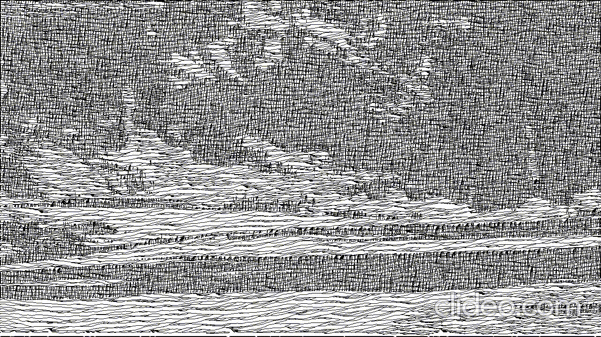

# video-stylization-by-particle-system

This program can process video and stylize video like drawing by hand. The coordinated particle system is based on the moving of particles and the trace of particles compose the stylized image. The difference between dark part and light part is based on the space between two particles’ trace. Darker areas have two layers of particle trace: vertical and horizontal. Lighter areas only have one horizontal layer. The video stylization is generated by match optical flow with key frames of dynamic area of video. There is one key frame in 10 frames of video and other frames are predicting by optical flow. 

***

### How to run this program
directly run main.py or main_by_match_keyFrame.py

#### Parameters

main.py is using the threshold method

main_by_match_keyFrame.py is using the keyframe method

Please change the input video file in main.py or main_by_match_keyFrame.py (default input is video/original_lions_video.mp4)

the global variable "outputIntensity" in algbp.py is the quality of output particle space: quality become higher when value be smaller

the program would output a output.avi at the root directory

###Support and libraries

This program needs **OpenCV 3.4** or above and **numpy**

**pip installed OpenCV is not supporting output video (python-opencv etc.)**

So please install full OpenCV library, I used libopencv 3.4.2 and python 3.7 from Anaconda 3

